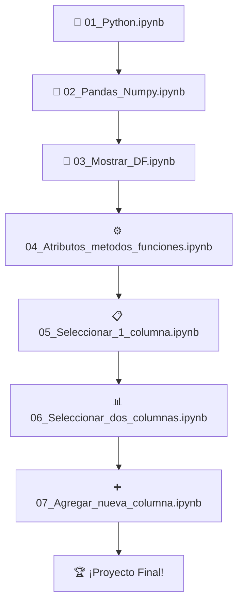

# 📊 Análisis de Datos con Python 🐍

<div align="center">


**¡Bienvenido al repositorio más completo de Análisis de Datos!** 🎉

*Una guía práctica y progresiva para dominar la ciencia de datos desde cero*

[🚀 Comenzar Ahora](#-instalación-y-configuración) • [📚 Ver Notebooks](#-contenido-de-los-notebooks) • [💡 Ejemplos](#-ejemplos-destacados) • [🤝 Contribuir](#-contribuciones)

</div>

---

## 📋 Índice de Navegación Rápida

<details>
<summary>🔍 <strong>Haz clic para expandir el índice completo</strong></summary>

### 🎯 **Información General**
- [🌟 Descripción del Proyecto](#-descripción-del-proyecto)
- [✨ Características Principales](#-características-principales)
- [🎯 Objetivos de Aprendizaje](#-objetivos-de-aprendizaje)
- [👥 Para Quién es Este Curso](#-para-quién-es-este-curso)

### 📚 **Contenido Educativo**
- [📓 Contenido de los Notebooks](#-contenido-de-los-notebooks)
- [💡 Ejemplos Destacados](#-ejemplos-destacados)
- [🏆 Proyectos Prácticos](#-proyectos-prácticos)
- [📊 Dataset Incluido](#-dataset)

### 🛠️ **Configuración y Uso**
- [⚙️ Instalación y Configuración](#️-instalación-y-configuración)
- [🚀 Cómo Usar Este Repositorio](#-cómo-usar-este-repositorio)
- [📁 Estructura del Proyecto](#-estructura-del-proyecto)
- [🔧 Tecnologías Utilizadas](#-tecnologías-utilizadas)

### 📖 **Recursos Adicionales**
- [📚 Recursos de Aprendizaje](#-recursos-de-aprendizaje)
- [❓ FAQ - Preguntas Frecuentes](#-faq---preguntas-frecuentes)
- [🐛 Solución de Problemas](#-solución-de-problemas)
- [🤝 Contribuciones](#-contribuciones)

### 📄 **Información Legal**
- [📝 Requisitos](#-requisitos)
- [📄 Licencia](#-licencia)
- [📞 Contacto](#-contacto)

</details>

---

## 🌟 Descripción del Proyecto

> **"El conocimiento es poder, pero el conocimiento aplicado es superpoder"** 💪

Este repositorio es tu **compañero definitivo** para dominar el análisis de datos con Python. Diseñado como una experiencia de aprendizaje progresiva, cada notebook construye sobre el conocimiento anterior, llevándote desde los fundamentos hasta técnicas avanzadas de análisis.

### ✨ Características Principales

<table>
<tr>
<td width="50%">

#### 🎓 **Aprendizaje Estructurado**
- 📖 Tutoriales paso a paso con explicaciones detalladas
- 🔄 Progresión lógica de conceptos
- 🧪 Ejercicios prácticos integrados
- ✅ Checkpoints de conocimiento

</td>
<td width="50%">

#### 💼 **Enfoque Práctico**
- 💡 Ejemplos con datos reales
- 🔍 Casos de uso del mundo real
- 📈 Visualizaciones profesionales
- 🎯 Proyectos aplicados

</td>
</tr>
<tr>
<td width="50%">

#### 🚀 **Tecnología Moderna**
- 🐍 Python 3.8+ con mejores prácticas
- 📊 Pandas y NumPy optimizados
- 📓 Jupyter Notebooks interactivos
- 🎨 Visualizaciones atractivas

</td>
<td width="50%">

#### 🌍 **Comunidad Activa**
- 🤝 Contribuciones bienvenidas
- 💬 Soporte de la comunidad
- 📚 Recursos adicionales
- 🔄 Actualizaciones regulares

</td>
</tr>
</table>

---

## 🎯 Objetivos de Aprendizaje

Al completar este curso, serás capaz de:

- ✅ **Dominar Python** para ciencia de datos
- ✅ **Manipular datos** eficientemente con Pandas
- ✅ **Realizar cálculos** numéricos con NumPy
- ✅ **Crear visualizaciones** impactantes
- ✅ **Analizar datasets** reales
- ✅ **Extraer insights** valiosos de los datos
- ✅ **Aplicar técnicas** de análisis exploratorio
- ✅ **Desarrollar proyectos** de ciencia de datos

---

## 👥 Para Quién es Este Curso

<div align="center">

| 🎯 **Principiantes** | 📈 **Intermedios** | 🚀 **Avanzados** |
|:---:|:---:|:---:|
| Sin experiencia previa | Conocimientos básicos | Quieren profundizar |
| Quieren aprender desde cero | Buscan estructurar conocimiento | Necesitan casos prácticos |
| Prefieren aprendizaje guiado | Quieren mejores prácticas | Buscan inspiración |

</div>

---

## 📚 Contenido de los Notebooks

<details>
<summary>📓 <strong>Haz clic para ver el contenido detallado de cada notebook</strong></summary>

### 🐍 **01_Python.ipynb** - Fundamentos de Python
<table>
<tr>
<td width="70%">

**📋 Contenido:**
- Variables y tipos de datos
- Estructuras de datos (listas, diccionarios, tuplas)
- Control de flujo (if, for, while)
- Funciones y módulos
- Manejo de errores básico

</td>
<td width="30%">

**⏱️ Duración:** 2-3 horas  
**📊 Nivel:** Principiante  
**🎯 Ejercicios:** 15+  
**💡 Conceptos:** 20+

</td>
</tr>
</table>

### 🔢 **02_Pandas_Numpy.ipynb** - Librerías Fundamentales
<table>
<tr>
<td width="70%">

**📋 Contenido:**
- Introducción a NumPy arrays
- Creación y manipulación de DataFrames
- Operaciones matemáticas básicas
- Indexación y selección de datos
- Primeras transformaciones

</td>
<td width="30%">

**⏱️ Duración:** 3-4 horas  
**📊 Nivel:** Principiante  
**🎯 Ejercicios:** 20+  
**💡 Conceptos:** 25+

</td>
</tr>
</table>

### 👀 **03_Mostrar_DF.ipynb** - Exploración Visual
<table>
<tr>
<td width="70%">

**📋 Contenido:**
- Métodos de inspección (.head(), .info(), .describe())
- Visualización de estructura de datos
- Identificación de tipos de datos
- Detección de valores faltantes
- Primeras estadísticas descriptivas

</td>
<td width="30%">

**⏱️ Duración:** 2 horas  
**📊 Nivel:** Principiante  
**🎯 Ejercicios:** 12+  
**💡 Conceptos:** 15+

</td>
</tr>
</table>

### ⚙️ **04_Atributos_metodos_funciones.ipynb** - Herramientas Avanzadas
<table>
<tr>
<td width="70%">

**📋 Contenido:**
- Atributos esenciales de DataFrames
- Métodos de agregación y transformación
- Funciones personalizadas con apply()
- Métodos de cadena (string methods)
- Optimización de operaciones

</td>
<td width="30%">

**⏱️ Duración:** 3-4 horas  
**📊 Nivel:** Intermedio  
**🎯 Ejercicios:** 18+  
**💡 Conceptos:** 30+

</td>
</tr>
</table>

### 📋 **05_Seleccionar_1_columna.ipynb** - Selección Básica
<table>
<tr>
<td width="70%">

**📋 Contenido:**
- Selección por nombre de columna
- Diferencia entre Series y DataFrame
- Indexación con loc e iloc
- Filtrado condicional básico
- Operaciones con series individuales

</td>
<td width="30%">

**⏱️ Duración:** 2-3 horas  
**📊 Nivel:** Principiante  
**🎯 Ejercicios:** 15+  
**💡 Conceptos:** 18+

</td>
</tr>
</table>

### 📊 **06_Seleccionar_dos_columnas.ipynb** - Selección Múltiple
<table>
<tr>
<td width="70%">

**📋 Contenido:**
- Selección múltiple de columnas
- Análisis comparativo entre variables
- Correlaciones básicas
- Filtrado con múltiples condiciones
- Agrupaciones simples

</td>
<td width="30%">

**⏱️ Duración:** 3 horas  
**📊 Nivel:** Intermedio  
**🎯 Ejercicios:** 16+  
**💡 Conceptos:** 22+

</td>
</tr>
</table>

### ➕ **07_Agregar_nueva_columna.ipynb** - Transformación de Datos
<table>
<tr>
<td width="70%">

**📋 Contenido:**
- Creación de columnas calculadas
- Transformaciones matemáticas
- Columnas condicionales
- Métricas personalizadas
- Validación de datos nuevos

</td>
<td width="30%">

**⏱️ Duración:** 2-3 horas  
**📊 Nivel:** Intermedio  
**🎯 Ejercicios:** 14+  
**💡 Conceptos:** 20+

</td>
</tr>
</table>

</details>

---

## 💡 Ejemplos Destacados

### 🎯 **Análisis de Rendimiento Estudiantil**
```python
# Ejemplo de análisis que encontrarás en los notebooks
import pandas as pd
import numpy as np

# Cargar y explorar datos
df = pd.read_csv('StudentsPerformance.csv')
print(f"📊 Dataset con {df.shape[0]} estudiantes y {df.shape[1]} variables")

# Análisis de correlaciones
correlation_matrix = df[['math score', 'reading score', 'writing score']].corr()
print("🔍 Correlaciones entre materias:")
print(correlation_matrix)
```

### 📈 **Visualizaciones Impactantes**
- Gráficos de distribución de calificaciones
- Análisis por género y etnia
- Comparativas de rendimiento
- Mapas de calor de correlaciones

---

## 🏆 Proyectos Prácticos

Durante el curso desarrollarás proyectos como:

1. **📊 Dashboard de Rendimiento Académico**
   - Análisis exploratorio completo
   - Identificación de factores clave
   - Visualizaciones interactivas

2. **🔍 Detector de Patrones Educativos**
   - Segmentación de estudiantes
   - Análisis de correlaciones
   - Recomendaciones basadas en datos

3. **📈 Predictor de Éxito Académico**
   - Análisis de variables predictivas
   - Creación de métricas personalizadas
   - Validación de hipótesis

---

## 🛠️ Instalación y Configuración

### 📋 Prerrequisitos

<table>
<tr>
<td width="50%">

#### 💻 **Sistema**
- 🖥️ Windows 10+, macOS 10.14+, o Linux
- 💾 Al menos 2GB de espacio libre
- 🌐 Conexión a internet (para instalación)

</td>
<td width="50%">

#### 🐍 **Software**
- Python 3.8 o superior
- pip (gestor de paquetes)
- Git (recomendado)

</td>
</tr>
</table>

### 🚀 Instalación Rápida (5 minutos)

<details>
<summary>🪟 <strong>Windows</strong></summary>

```powershell
# 1. Clona el repositorio
git clone https://github.com/tu-usuario/Analizis_de_Datos.git
cd Analizis_de_Datos

# 2. Crea y activa el entorno virtual
python -m venv venv
venv\Scripts\activate

# 3. Instala dependencias
pip install -r requirements.txt

# 4. Inicia Jupyter
jupyter notebook
```

</details>

<details>
<summary>🍎 <strong>macOS</strong></summary>

```bash
# 1. Clona el repositorio
git clone https://github.com/tu-usuario/Analizis_de_Datos.git
cd Analizis_de_Datos

# 2. Crea y activa el entorno virtual
python3 -m venv venv
source venv/bin/activate

# 3. Instala dependencias
pip install -r requirements.txt

# 4. Inicia Jupyter
jupyter notebook
```

</details>

<details>
<summary>🐧 <strong>Linux</strong></summary>

```bash
# 1. Clona el repositorio
git clone https://github.com/tu-usuario/Analizis_de_Datos.git
cd Analizis_de_Datos

# 2. Crea y activa el entorno virtual
python3 -m venv venv
source venv/bin/activate

# 3. Instala dependencias
pip install -r requirements.txt

# 4. Inicia Jupyter
jupyter notebook
```

</details>

### ✅ Verificación de Instalación

Ejecuta este código en un notebook para verificar que todo funciona:

```python
import pandas as pd
import numpy as np
import matplotlib.pyplot as plt

print("✅ ¡Todo instalado correctamente!")
print(f"🐍 Python: {pd.__version__}")
print(f"📊 Pandas: {pd.__version__}")
print(f"🔢 NumPy: {np.__version__}")
```

---

## 🚀 Cómo Usar Este Repositorio

### 📚 **Ruta de Aprendizaje Recomendada**



### 💡 **Metodología de Estudio**

<table>
<tr>
<td width="25%">

#### 📖 **1. Leer**
- Revisa las explicaciones
- Entiende los conceptos
- Toma notas importantes

</td>
<td width="25%">

#### 💻 **2. Ejecutar**
- Corre cada celda
- Observa los resultados
- Experimenta con variaciones

</td>
<td width="25%">

#### 🧪 **3. Practicar**
- Completa los ejercicios
- Modifica los ejemplos
- Crea tus propias pruebas

</td>
<td width="25%">

#### 🔄 **4. Revisar**
- Repasa conceptos difíciles
- Conecta con conocimientos previos
- Aplica en nuevos contextos

</td>
</tr>
</table>

### 🎯 **Consejos para el Éxito**

> 💡 **Tip del Experto:** La clave está en la práctica constante y la experimentación

- ⏰ **Dedica tiempo regular** - Mejor 30 min diarios que 5 horas una vez
- 🤔 **No tengas miedo de experimentar** - Los errores son parte del aprendizaje
- 📚 **Consulta documentación** - Es tu mejor amiga en ciencia de datos
- 🔄 **Repite hasta dominar** - La repetición crea maestría
- 💬 **Únete a la comunidad** - Aprende de otros y comparte tu conocimiento

---

## 📁 Estructura del Proyecto

```
📂 Analizis_de_Datos/
│
├── 📂 DataScience/                 # 🎓 Notebooks educativos
│   ├── 📓 01_Python.ipynb         # 🐍 Fundamentos de Python
│   ├── 📓 02_Pandas_Numpy.ipynb   # 🔢 Librerías esenciales
│   ├── 📓 03_Mostrar_DF.ipynb     # 👀 Exploración visual
│   ├── 📓 04_Atributos_metodos_funciones.ipynb  # ⚙️ Herramientas avanzadas
│   ├── 📓 05_Seleccionar_1_columna.ipynb        # 📋 Selección básica
│   ├── 📓 06_Seleccionar_dos_columnas.ipynb     # 📊 Selección múltiple
│   ├── 📓 07_Agregar_nueva_columna.ipynb        # ➕ Transformación de datos
│   └── 📊 StudentsPerformance.csv # 🎓 Dataset de práctica
│
├── 📂 venv/                        # 🔧 Entorno virtual
│   ├── 📂 bin/                     # 🛠️ Ejecutables
│   ├── 📂 lib/                     # 📚 Librerías instaladas
│   └── 📄 pyvenv.cfg              # ⚙️ Configuración del entorno
│
├── 📄 README.md                    # 📖 Este archivo (¡estás aquí!)
├── 📄 requirements.txt             # 📋 Dependencias del proyecto
└── 📄 .gitignore                   # 🚫 Archivos ignorados por Git
```

---

## 📊 Dataset

### 🎓 **StudentsPerformance.csv** - Tu Laboratorio de Datos

<div align="center">

| 📊 **Estadísticas del Dataset** |
|:---:|
| **1,000 estudiantes** |
| **8 variables** |
| **3 materias evaluadas** |
| **Datos reales y limpios** |

</div>

#### 📋 **Variables Incluidas:**

<table>
<tr>
<td width="50%">

**👥 Demográficas:**
- 🚻 Género (male/female)
- 🌍 Grupo étnico (A, B, C, D, E)
- 🎓 Educación parental (6 niveles)

</td>
<td width="50%">

**📚 Académicas:**
- 🔢 Puntuación en Matemáticas (0-100)
- 📖 Puntuación en Lectura (0-100)
- ✍️ Puntuación en Escritura (0-100)

</td>
</tr>
<tr>
<td colspan="2">

**🍽️ Factores Adicionales:**
- 🥪 Tipo de almuerzo (standard/free-reduced)
- 📝 Curso de preparación (completed/none)

</td>
</tr>
</table>

#### 🎯 **Perfecto para Aprender:**

- 📈 **Análisis exploratorio** - Descubre patrones ocultos
- 🔍 **Correlaciones** - Encuentra relaciones entre variables
- 📊 **Visualizaciones** - Crea gráficos impactantes
- 🧮 **Estadísticas** - Calcula métricas descriptivas
- 🎯 **Segmentación** - Agrupa estudiantes por características
- 💡 **Insights** - Extrae conclusiones valiosas

---

## 🔧 Tecnologías Utilizadas

<div align="center">

### 🌟 **Stack Tecnológico Principal**

| Tecnología | Versión | Descripción | Uso en el Proyecto |
|:---:|:---:|:---:|:---:|
| 🐍 **Python** | 3.8+ | Lenguaje principal | Base de todo el desarrollo |
| 📊 **Pandas** | Latest | Manipulación de datos | Análisis y transformaciones |
| 🔢 **NumPy** | Latest | Computación numérica | Cálculos matemáticos |
| 📓 **Jupyter** | Latest | Notebooks interactivos | Entorno de desarrollo |
| 🎨 **Matplotlib** | Latest | Visualización básica | Gráficos y plots |
| 🐛 **IPython** | Latest | Shell mejorado | Interactividad avanzada |

### 🛠️ **Herramientas de Desarrollo**

| Herramienta | Propósito | Beneficio |
|:---:|:---:|:---:|
| 🔧 **venv** | Entornos virtuales | Aislamiento de dependencias |
| 📦 **pip** | Gestor de paquetes | Instalación de librerías |
| 🌐 **Git** | Control de versiones | Seguimiento de cambios |
| 📝 **Markdown** | Documentación | Explicaciones claras |

</div>

---

## 📚 Recursos de Aprendizaje

### 📖 **Documentación Oficial**
- 🐍 [Python.org](https://docs.python.org/3/) - Documentación completa de Python
- 📊 [Pandas Docs](https://pandas.pydata.org/docs/) - Guía oficial de Pandas
- 🔢 [NumPy Docs](https://numpy.org/doc/) - Referencia de NumPy
- 📓 [Jupyter Docs](https://jupyter.org/documentation) - Todo sobre Jupyter

### 🎓 **Cursos Complementarios**
- 🌟 [Kaggle Learn](https://www.kaggle.com/learn) - Cursos gratuitos de ciencia de datos
- 📚 [DataCamp](https://www.datacamp.com/) - Plataforma interactiva
- 🎯 [Coursera Data Science](https://www.coursera.org/browse/data-science) - Especializaciones universitarias
- 💻 [edX Analytics](https://www.edx.org/learn/data-analysis) - Cursos de universidades top

### 📊 **Datasets para Practicar**
- 🏆 [Kaggle Datasets](https://www.kaggle.com/datasets) - Miles de datasets
- 🏛️ [UCI ML Repository](https://archive.ics.uci.edu/ml/) - Datasets clásicos
- 🌍 [Google Dataset Search](https://datasetsearch.research.google.com/) - Buscador de datasets
- 📈 [FiveThirtyEight Data](https://data.fivethirtyeight.com/) - Datos de noticias

### 🛠️ **Herramientas Adicionales**
- 🎨 [Seaborn](https://seaborn.pydata.org/) - Visualizaciones estadísticas
- 📊 [Plotly](https://plotly.com/python/) - Gráficos interactivos
- 🔍 [Scikit-learn](https://scikit-learn.org/) - Machine Learning
- 📝 [Streamlit](https://streamlit.io/) - Apps web para datos

---

## ❓ FAQ - Preguntas Frecuentes

<details>
<summary><strong>🤔 ¿Necesito experiencia previa en programación?</strong></summary>

**¡No!** Este curso está diseñado para principiantes absolutos. Comenzamos desde los fundamentos de Python y avanzamos gradualmente. Si tienes experiencia previa, podrás avanzar más rápido por las primeras secciones.

</details>

<details>
<summary><strong>⏰ ¿Cuánto tiempo necesito para completar el curso?</strong></summary>

**Depende de tu ritmo:**
- **Principiante completo:** 4-6 semanas (2-3 horas por semana)
- **Con algo de experiencia:** 2-3 semanas (3-4 horas por semana)
- **Desarrollador experimentado:** 1-2 semanas (revisión y práctica)

</details>

<details>
<summary><strong>💻 ¿Qué especificaciones necesita mi computadora?</strong></summary>

**Requisitos mínimos:**
- 4GB RAM (8GB recomendado)
- 2GB espacio libre
- Cualquier sistema operativo moderno
- Conexión a internet para instalación inicial

</details>

<details>
<summary><strong>🆘 ¿Qué hago si encuentro un error?</strong></summary>

**Pasos recomendados:**
1. 🔍 Revisa la sección de [Solución de Problemas](#-solución-de-problemas)
2. 🔄 Reinicia el kernel de Jupyter
3. 📚 Consulta la documentación oficial
4. 🐛 Abre un issue en GitHub con detalles del error
5. 💬 Pregunta en la comunidad

</details>

<details>
<summary><strong>📱 ¿Puedo usar este curso en tablet o móvil?</strong></summary>

**Parcialmente.** Puedes leer el contenido en cualquier dispositivo, pero para ejecutar código necesitas una computadora. Recomendamos usar una laptop o desktop para la mejor experiencia.

</details>

<details>
<summary><strong>🌍 ¿Está disponible en otros idiomas?</strong></summary>

Actualmente está en español, pero aceptamos contribuciones para traducir a otros idiomas. ¡Consulta la sección de [contribuciones](#-contribuciones)!

</details>

---

## 🐛 Solución de Problemas

### 🚨 **Problemas Comunes y Soluciones**

<details>
<summary><strong>❌ Error: "ModuleNotFoundError"</strong></summary>

**Causa:** Librería no instalada o entorno virtual no activado.

**Solución:**
```bash
# Activa el entorno virtual
source venv/bin/activate  # macOS/Linux
# o
venv\Scripts\activate     # Windows

# Reinstala dependencias
pip install -r requirements.txt
```

</details>

<details>
<summary><strong>🔄 Jupyter no inicia o se cuelga</strong></summary>

**Soluciones:**
1. **Reinicia el terminal** y vuelve a intentar
2. **Verifica el puerto:** `jupyter notebook --port=8889`
3. **Limpia cache:** `jupyter --paths` y elimina carpetas temporales
4. **Reinstala Jupyter:** `pip uninstall jupyter && pip install jupyter`

</details>

<details>
<summary><strong>📊 Dataset no se carga correctamente</strong></summary>

**Verificaciones:**
1. **Ruta correcta:** Asegúrate de que `StudentsPerformance.csv` esté en `DataScience/`
2. **Encoding:** Usa `pd.read_csv('file.csv', encoding='utf-8')`
3. **Separador:** Verifica si usa comas o punto y coma

</details>

<details>
<summary><strong>🐍 Problemas con versiones de Python</strong></summary>

**Recomendación:**
- Usa Python 3.8 o superior
- Verifica con: `python --version`
- Si tienes múltiples versiones, usa: `python3.8 -m venv venv`

</details>

### 🆘 **¿Necesitas Más Ayuda?**

1. 📖 **Consulta la documentación** de la librería específica
2. 🔍 **Busca en Stack Overflow** con el mensaje de error exacto
3. 🐛 **Abre un issue** en GitHub con:
   - Descripción del problema
   - Código que causa el error
   - Mensaje de error completo
   - Tu sistema operativo y versión de Python

---

## 📝 Requisitos

### 📦 **Dependencias Principales**

```txt
# Core Data Science Stack
jupyter>=1.0.0          # 📓 Notebooks interactivos
pandas>=1.3.0           # 📊 Manipulación de datos
numpy>=1.21.0           # 🔢 Computación numérica
matplotlib>=3.4.0       # 🎨 Visualización básica

# Development Tools
ipython>=7.0.0          # 🐛 Shell interactivo mejorado
ipykernel>=6.0.0        # 🔧 Kernel de Jupyter

# Optional but Recommended
seaborn>=0.11.0         # 🎨 Visualizaciones estadísticas
plotly>=5.0.0           # 📊 Gráficos interactivos
```

### 🔧 **Instalación de Dependencias**

```bash
# Instalación básica
pip install -r requirements.txt

# Instalación con dependencias opcionales
pip install -r requirements.txt seaborn plotly

# Verificación de instalación
python -c "import pandas, numpy, matplotlib; print('✅ Todo instalado correctamente!')"
```

---

## 🤝 Contribuciones

<div align="center">

### 🌟 **¡Tu Contribución Hace la Diferencia!**

*Juntos podemos crear el mejor recurso de aprendizaje de ciencia de datos en español*

</div>

### 🚀 **Cómo Contribuir**

<table>
<tr>
<td width="50%">

#### 🔧 **Para Desarrolladores**
1. 🍴 Fork el repositorio
2. 🌿 Crea una rama: `git checkout -b feature/nueva-funcionalidad`
3. 💾 Commit cambios: `git commit -m 'Agregar nueva funcionalidad'`
4. 📤 Push: `git push origin feature/nueva-funcionalidad`
5. 🔄 Abre un Pull Request

</td>
<td width="50%">

#### 📚 **Para Educadores**
1. 📝 Mejora explicaciones existentes
2. 🧪 Agrega ejercicios prácticos
3. 📊 Incluye más ejemplos
4. 🎨 Mejora visualizaciones
5. 🌍 Traduce contenido

</td>
</tr>
</table>

### 💡 **Ideas para Contribuir**

<details>
<summary><strong>📚 Contenido Educativo</strong></summary>

- ➕ Agregar notebooks sobre temas avanzados (ML, estadística, etc.)
- 🔍 Mejorar explicaciones de conceptos complejos
- 🧪 Crear más ejercicios prácticos
- 📊 Incluir más datasets de ejemplo
- 🎯 Desarrollar proyectos finales

</details>

<details>
<summary><strong>🛠️ Mejoras Técnicas</strong></summary>

- 🐛 Corregir errores en el código
- ⚡ Optimizar rendimiento de notebooks
- 🔧 Mejorar configuración del entorno
- 📱 Hacer el contenido más responsive
- 🔒 Implementar mejores prácticas de seguridad

</details>

<details>
<summary><strong>🎨 Diseño y UX</strong></summary>

- 🎨 Mejorar visualizaciones
- 📱 Optimizar para diferentes dispositivos
- 🌈 Crear temas personalizados
- 📊 Diseñar mejores gráficos
- 🖼️ Agregar diagramas explicativos

</details>

<details>
<summary><strong>🌍 Comunidad</strong></summary>

- 🌐 Traducir a otros idiomas
- 📖 Escribir tutoriales adicionales
- 🎥 Crear contenido multimedia
- 💬 Moderar discusiones
- 🏆 Organizar competencias

</details>

### 🏆 **Reconocimientos**

Todos los contribuidores serán reconocidos en:
- 📜 Lista de contribuidores en el README
- 🎖️ Badges especiales en GitHub
- 🌟 Menciones en redes sociales
- 📚 Créditos en futuras versiones

### 📋 **Guías de Contribución**

- 📝 **Código:** Sigue PEP 8 para Python
- 📚 **Documentación:** Usa Markdown con emojis apropiados
- 🧪 **Testing:** Verifica que todos los notebooks funcionen
- 💬 **Comunicación:** Sé respetuoso y constructivo

---

## 📄 Licencia

<div align="center">

### 📜 **Licencia MIT**

*Este proyecto está bajo la Licencia MIT - consulta el archivo [LICENSE](LICENSE) para más detalles.*

</div>

#### 🔓 **¿Qué Puedes Hacer?**

✅ **Usar** el código para cualquier propósito  
✅ **Modificar** y adaptar a tus necesidades  
✅ **Distribuir** copias del proyecto  
✅ **Vender** productos basados en este código  
✅ **Contribuir** mejoras al proyecto original  

#### 📋 **Únicos Requisitos**

- 📄 Incluir el aviso de copyright original
- 📜 Incluir la licencia MIT en distribuciones
- 🚫 No usar nuestro nombre para promocionar derivados sin permiso

#### 💡 **¿Por Qué MIT?**

Elegimos MIT porque creemos en:
- 🌍 **Acceso libre** al conocimiento
- 🤝 **Colaboración** sin barreras
- 🚀 **Innovación** sin restricciones
- 📚 **Educación** para todos

---

## 📞 Contacto

<div align="center">

### 🌟 **¡Conectemos y Aprendamos Juntos!**

*¿Tienes preguntas, sugerencias o quieres colaborar? ¡Nos encantaría saber de ti!*

</div>

<table>
<tr>
<td width="50%">

#### 💬 **Canales de Comunicación**
- 📧 **Email:** [tu-email@ejemplo.com](mailto:tu-email@ejemplo.com)
- 💼 **LinkedIn:** [Tu Perfil Profesional](https://linkedin.com/in/tu-perfil)
- 🐙 **GitHub:** [Tu Perfil de GitHub](https://github.com/tu-usuario)
- 🐦 **Twitter:** [@tu_usuario](https://twitter.com/tu_usuario)

</td>
<td width="50%">

#### 🤝 **Comunidad**
- 💬 **Discussions:** Usa GitHub Discussions para preguntas
- 🐛 **Issues:** Reporta bugs o solicita features
- 📚 **Wiki:** Consulta documentación adicional
- 🌟 **Síguenos:** Para actualizaciones y noticias

</td>
</tr>
</table>

### 📅 **Horarios de Respuesta**

- 📧 **Email:** 24-48 horas
- 🐛 **Issues:** 1-3 días laborales
- 💬 **Discussions:** Respuesta comunitaria
- 🚨 **Urgente:** Usa el tag "urgent" en issues

### 🎯 **¿Qué Tipo de Mensajes Enviarnos?**

<table>
<tr>
<td width="33%">

#### ✅ **Bienvenidos**
- 🤔 Preguntas sobre el contenido
- 🐛 Reportes de errores
- 💡 Sugerencias de mejora
- 🤝 Propuestas de colaboración

</td>
<td width="33%">

#### 🎯 **Preferidos**
- 📚 Feedback constructivo
- 🌟 Casos de éxito
- 📊 Proyectos usando nuestro código
- 🌍 Oportunidades de traducción

</td>
<td width="33%">

#### ❌ **Evitar**
- 🚫 Spam o promociones
- 😤 Mensajes ofensivos
- 🔄 Preguntas ya respondidas en FAQ
- 📱 Soporte técnico básico (usa Google primero)

</td>
</tr>
</table>

---

<div align="center">

## 🌟 ¡Gracias por Ser Parte de Esta Aventura!

### 🚀 **¡El Futuro de los Datos Te Espera!**

*Si este repositorio te ha sido útil, no olvides:*

⭐ **Darle una estrella** al proyecto  
🔄 **Compartirlo** con otros estudiantes  
🤝 **Contribuir** con mejoras  
📢 **Seguirnos** para más contenido  

### 📊 **Estadísticas del Proyecto**


---

### 🎉 **¡Feliz Aprendizaje!**

**Recuerda:** *Cada experto fue una vez un principiante. Cada profesional fue una vez un amateur. Cada icono fue una vez un desconocido.*

🚀📊🐍 **¡Que comience tu viaje en la ciencia de datos!** 🐍📊🚀

</div>

---

<div align="center">
<sub>Hecho con ❤️ para la comunidad de ciencia de datos | Última actualización: 2024</sub>
</div>